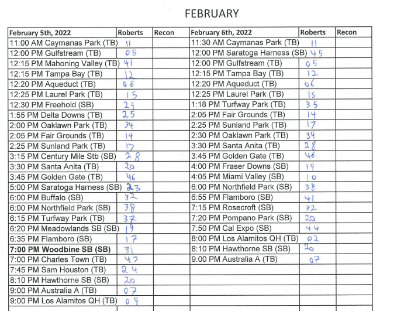
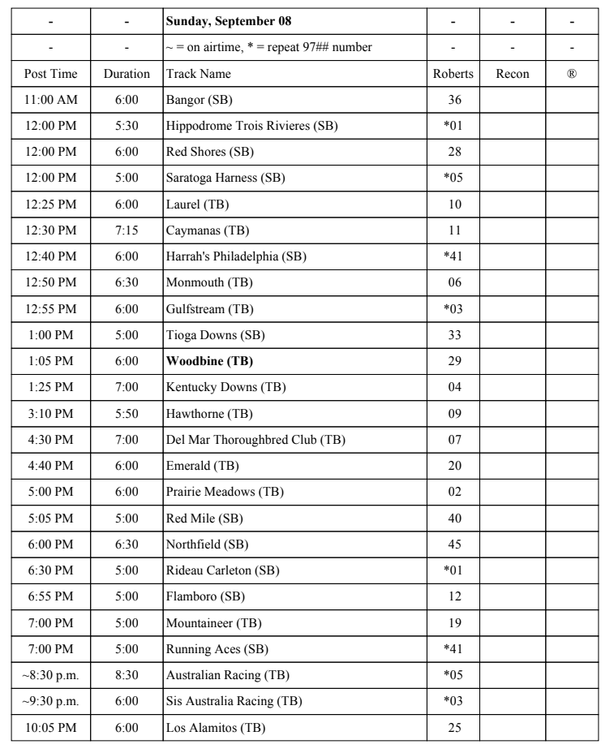
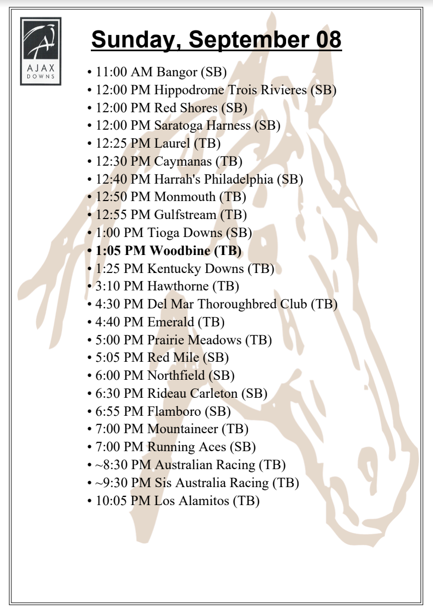

# Simulcast-bot

## Summary
This data scraping bot is designed to cut out a lot of tedious work. **A full explanation of every detail is provided at 
the end of this readme.** In summary, the bot goes to two different website 
and grabs data from both. It then aggregates the data together and compiles it into two usable sheets that use to be
made by myself and my coworkers every day. 

## Technical Details
This bot makes two requests using python's requests library to
[RTN's Schedule](https://www.rtn.tv/schedule/schedule.aspx) and [Woodbine's Schedule](https://woodbine.com/simulcasts/).
It then parses the data with Beautiful Soup and pulls the relevant info. Using the 
[FPDF2](https://py-pdf.github.io/fpdf2/index.html) library, two PDFs are compiled. The PDFs are emailed out every
morning at 9am.

## Technical Features
- A flask webserver that pings [An Uptime Website](https://healthchecks.io/) every minute. I do this because I host this bot on a spare computer.
- The flask webserver also has a couple of debug features.
- A small database that can be edited via Json and Txt files. This allows me to edit the database while the bot is running.
- Automated email through Python's email API.

## The future of this project
I did this project out of passion and aiming to eliminate spending 20+ minutes every shift making infographics for
customers to use. I would love to continue this project, adding features such as, the ability to edit the database via
a web UI. This project is also very dependent on me managing and maintaining the upkeep of it. I definitely would make
this much more user-friendly to host and manage.

Unfortunately the reality is, it would be a large undertaking for very little payoff. That being said, I learned a lot
about making a useful and practical application, the experience I gained was invaluable.

## Full Explanation
I work as a teller at Ajax Downs, people come in to watch horse races from different tracks around the world. Part of
my job as a teller is to make a table of all the tracks, so customers know which tracks are running. I also have to make
a similar document to assist with programming the TV channels. The document to program the channels looks like this:

Every day, the teller working would have to pull this data from an Excel spreadsheet, print it, go to the 
[RTN website](https://www.rtn.tv/schedule/schedule.aspx) and write in all the channel numbers, so we could program the 
TV's. 

This is where the Simulcast-bot comes in. Every day at 9am (scheduled through a flask server, which also handles pings
to [Healthchecks.io](https://healthchecks.io/)) the bot will go to 
[RTN's schedule](https://www.rtn.tv/schedule/schedule.aspx) and pull down all the tracks for the day, along with their
channel numbers. The bot will then go to [Woodbine's schedule](https://woodbine.com/simulcasts/) and attempt to match
the RTN tracks to the Woodbine tracks to get a post time (_a post time is what time the first race at that track 
starts at_). Through each step of this process, a small database (created and curated by me) is referenced to ensure
the sheet always looks clean and in a specific way. After the data is scraped and parsed, the bot will process it and
compile it into two PDFs (seen below). Finally, the bot will email out the report, so the teller that is working can 
print it out.

### The RTN Channel Sheet

### The Track Sheet

 
